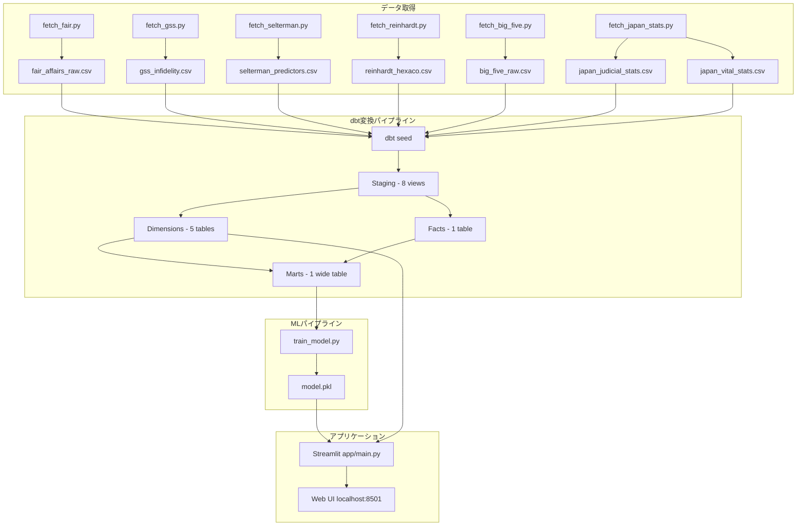

# Architecture

## 1. アーキテクチャ概要



**構成要素:**

| レイヤー | 技術 | 役割 |
|----------|------|------|
| データ取得 | Python スクリプト | 学術データセットの取得・CSV 化 |
| データ変換 | dbt + DuckDB | SQL ベースの正規化・特徴量テーブル構築 |
| ML | scikit-learn + SHAP | RandomForest による予測と SHAP による説明 |
| UI | Streamlit + Plotly | インタラクティブな予測インターフェース |

---

## 2. ディレクトリ構成

```
infidelity-predictor/
├── app/
│   └── main.py                   # Streamlit アプリ本体
├── images/
│   └── image.png                 # ヘッダー画像
├── models/                       # dbt SQL モデル
│   ├── staging/                  # データクレンジング (8 views)
│   ├── dimensions/               # ディメンションテーブル (5 tables)
│   ├── facts/                    # ファクトテーブル (1 table)
│   ├── marts/                    # ML 用ワイドテーブル (1 table)
│   └── sources.yml               # データソース定義
├── models_ml/
│   └── model.pkl                 # 学習済みモデル + SHAP + Imputer
├── scripts/                      # データ取得・モデル学習
│   ├── fetch_fair.py
│   ├── fetch_gss.py
│   ├── fetch_selterman.py
│   ├── fetch_reinhardt.py
│   ├── fetch_big_five.py
│   ├── fetch_japan_stats.py
│   └── train_model.py
├── seeds/                        # 取得済み CSV (7 ファイル)
├── dbt_project.yml               # dbt プロジェクト設定
├── profiles.yml                  # dbt DuckDB アダプター設定
├── requirements.txt              # Python 依存パッケージ
└── infidelity_predictor.duckdb   # DuckDB データベース
```

---

## 3. データパイプライン

### 3.1 データソース

| ソース | スクリプト | 件数 | 主要変数 |
|--------|-----------|------|----------|
| Fair (1978) | `fetch_fair.py` | 6,366 | 年齢, 教育, 宗教心, 婚姻満足度, 浮気有無 |
| GSS (NORC) | `fetch_gss.py` | 10,000 | 年齢, 性別, 教育, 婚姻幸福度, 婚外交渉 |
| Vowels et al. (2022) | `fetch_selterman.py` | 1,295 | 関係満足度, 愛情, 欲求, 愛着スタイル |
| Reinhardt (2023) | `fetch_reinhardt.py` | 5,677 | HEXACO 6因子, 関係不誠実 |
| Open Psychometrics | `fetch_big_five.py` | 19,719 | Big Five (性格参照値用) |
| 裁判所統計 | `fetch_japan_stats.py` | 24 | 離婚申立動機 (年齢・性別別) |
| 人口動態統計 | `fetch_japan_stats.py` | 17 | 離婚率 (婚姻期間・年齢別) |

各スクリプトは公式ソースからのダウンロードを試み、失敗時は公表統計に基づく合成データを生成する。

### 3.2 dbt 変換レイヤー

DuckDB 内のスキーマ構成:

```
main_raw         → seeds/ の CSV を格納
main_staging     → ソースごとのクレンジング (8 views)
main_dimensions  → 統合ディメンション (5 tables)
main_facts       → 統合ファクト (1 table)
main_marts       → ML 入力用ワイドテーブル (1 table)
```

**Staging (views):** 各データソースの列名・型・値を標準化。ブール値の浮気フラグ (`had_affair`) を統一的に生成。

**Dimensions (tables):**

| テーブル | 内容 |
|----------|------|
| `dim_person` | 4ソースの人物属性を統合 (性別, 年齢, 教育, 宗教心, 職業) |
| `dim_personality` | HEXACO 6因子 (Reinhardt のみ完全、他は NULL → 学習時に中央値補完) |
| `dim_relationship` | 交際年数, 子供の有無, 満足度, 愛情, 欲求, 愛着スタイル |
| `dim_japan_context` | 日本の司法・人口統計 (UI 表示用) |
| `dim_personality_reference` | 性格特性の平均・標準偏差・四分位 (レーダーチャート用) |

**Facts (table):** `fct_infidelity` - 4ソースの浮気事実を統合。目的変数 `had_affair` とディメンションキーを保持。

**Marts (table):** `marts_infidelity_features` - Facts と全 Dimensions を結合した15特徴量 + 目的変数のワイドテーブル。ML の直接入力。

---

## 4. ML パイプライン

### 4.1 特徴量 (15変数)

| カテゴリ | 特徴量 | ソース別カバレッジ |
|----------|--------|-------------------|
| 人口統計 | `age` | Fair, GSS, Selterman, Reinhardt |
| | `education_years` | Fair, GSS |
| | `religiousness` | Fair, GSS |
| | `occupation` | Fair |
| HEXACO | `honesty_humility` | Reinhardt |
| | `emotionality` | Reinhardt |
| | `extraversion` | Reinhardt |
| | `agreeableness` | Reinhardt |
| | `conscientiousness` | Reinhardt |
| | `openness` | Reinhardt |
| 関係性 | `years_in_relationship` | Selterman, Reinhardt |
| | `has_children` | Fair |
| | `satisfaction_rating` | Fair, GSS, Selterman |
| | `love_rating` | Selterman |
| | `desire_rating` | Selterman |

ソースにない特徴量は NULL となり、学習時に `SimpleImputer(strategy='median')` で補完される。

### 4.2 特徴量の寄与度

学習済みモデルから算出した特徴量重要度 (Gini Importance) と、500サンプルでの平均絶対 SHAP 値を示す。

| 順位 | 特徴量 | Gini Importance | Mean SHAP | 解釈 |
|:----:|--------|:-----------:|:----------:|------|
| 1 | `honesty_humility` | 0.2961 | 0.0513 | 誠実-謙虚さが低いほどリスク上昇 |
| 2 | `satisfaction_rating` | 0.1826 | 0.0678 | 関係満足度が低いほどリスク上昇 |
| 3 | `years_in_relationship` | 0.1653 | 0.0571 | 交際期間が長いほどリスク上昇 |
| 4 | `religiousness` | 0.0662 | 0.0315 | 宗教心が高いほどリスク低下 |
| 5 | `age` | 0.0584 | 0.0118 | 年齢による非線形な影響 |
| 6 | `desire_rating` | 0.0471 | 0.0162 | 性的欲求が高いほどリスク上昇 |
| 7 | `love_rating` | 0.0397 | 0.0126 | 愛情度が高いほどリスク低下 |
| 8 | `education_years` | 0.0274 | 0.0062 | 教育年数の影響は小さい |
| 9 | `occupation` | 0.0200 | 0.0059 | 職業カテゴリの影響は小さい |
| 10 | `conscientiousness` | 0.0186 | 0.0019 | 誠実性の影響は限定的 |
| 11 | `agreeableness` | 0.0183 | 0.0027 | 協調性の影響は限定的 |
| 12 | `openness` | 0.0179 | 0.0034 | 開放性の影響は限定的 |
| 13 | `emotionality` | 0.0177 | 0.0030 | 情動性の影響は限定的 |
| 14 | `extraversion` | 0.0176 | 0.0026 | 外向性の影響は限定的 |
| 15 | `has_children` | 0.0072 | 0.0040 | 子供の有無の影響は最小 |

> **Gini Importance** はツリー分割での不純度減少の合計（グローバルな重要度）。**Mean SHAP** は個別予測への平均的な寄与の大きさ（絶対値）。上位3特徴量（誠実-謙虚さ、関係満足度、交際期間）でモデル寄与の約65%を占める。

### 4.3 モデル構成

```
アルゴリズム: RandomForestClassifier
├── n_estimators: 200
├── max_depth: 10
├── min_samples_split: 10
├── min_samples_leaf: 5
├── class_weight: balanced
└── random_state: 42

評価: 5-fold Cross-Validation (AUC-ROC, F1)
説明: SHAP TreeExplainer (500サンプルで計算)
```

### 4.4 アーティファクト

`models_ml/model.pkl` に以下を pickle で保存:

| キー | 内容 |
|------|------|
| `model` | 学習済み RandomForestClassifier |
| `explainer` | SHAP TreeExplainer |
| `imputer` | 学習データで fit 済みの SimpleImputer |
| `feature_names` | 特徴量名リスト (順序保持) |

---

## 5. アプリケーション層

### 5.1 UI フロー

```
Step 1: パートナーの基本情報
  年齢, 学歴, 職業レベル (1-7), 信仰心 (1-5), 子供の有無
        ↓
Step 2: パートナーの性格 (HEXACO 6因子)
  誠実-謙虚さ, 情緒性, 外向性, 協調性, 誠実性, 開放性
  ※ 各項目に「高い人の例」「低い人の例」のヘルプ付き
        ↓
Step 3: 関係性の情報
  交際年数, 満足度, 愛情, 欲求
  ※ パートナー視点 (相手が自分をどう思うか) で回答
        ↓
分析実行
        ↓
分析結果
  ├── ゲージチャート (浮気確率 %)
  ├── レーダーチャート (HEXACO: 入力値 vs 母集団平均)
  ├── ウォーターフォールチャート (SHAP 上位10要因)
  ├── 解釈ポイント (上位3要因の自然言語説明)
  └── 日本の統計コンテキスト (年齢別離婚申立率)
```

### 5.2 可視化コンポーネント

| チャート | ライブラリ | 内容 |
|----------|-----------|------|
| ゲージ | Plotly Indicator | 確率 0-100%、リスクレベル色分け (緑/橙/赤) |
| レーダー | Plotly Scatterpolar | HEXACO 6因子、入力値と母集団平均の比較 |
| ウォーターフォール | Plotly Bar (横) | SHAP 値上位10件、赤=リスク上昇 / 緑=リスク低下 |

### 5.3 キャッシュ戦略

`@st.cache_resource` で以下をキャッシュ:

- モデル・SHAP・Imputer (`model.pkl` の読み込み)
- 性格参照データ (`dim_personality_reference` からの読み込み)
- 日本統計データ (`dim_japan_context` からの読み込み)

---

## 6. 技術スタック

| ライブラリ | 役割 |
|-----------|------|
| **streamlit** | Web UI フレームワーク |
| **dbt-core** + **dbt-duckdb** | SQL 変換オーケストレーション |
| **duckdb** | 組み込み列指向データベース |
| **scikit-learn** | RandomForest, SimpleImputer, cross-validation |
| **shap** | モデル解釈 (TreeExplainer) |
| **plotly** | インタラクティブチャート |
| **pandas** / **numpy** | データ操作・数値計算 |
| **statsmodels** | Fair データセット取得 |
| **pyreadstat** | SPSS ファイル読み込み (OSF データ) |
| **requests** | HTTP リクエスト (OSF API) |

---

## 7. 実行フロー

```bash
# 1. 環境構築
python3 -m venv .venv && source .venv/bin/activate
pip install -r requirements.txt

# 2. データ取得 (seeds/ に CSV を出力)
python scripts/fetch_fair.py
python scripts/fetch_gss.py
python scripts/fetch_selterman.py
python scripts/fetch_reinhardt.py
python scripts/fetch_big_five.py
python scripts/fetch_japan_stats.py

# 3. dbt パイプライン実行 (DuckDB にテーブル構築)
dbt seed --profiles-dir .
dbt run --profiles-dir .

# 4. モデル学習 (models_ml/model.pkl を出力)
python scripts/train_model.py

# 5. アプリ起動
streamlit run app/main.py
```
